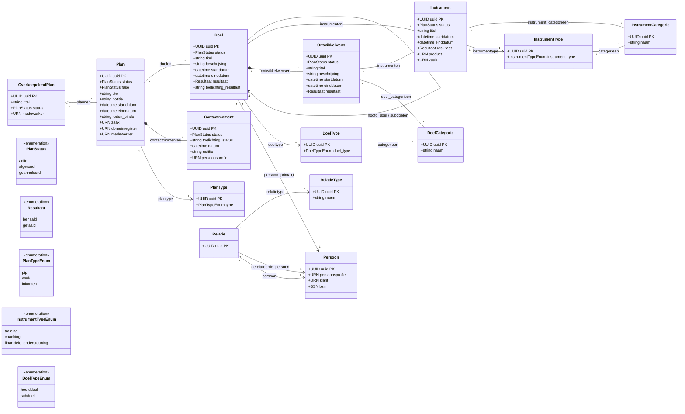

# Open Plan – domeinmodel

> Gegenereerd via reverse-engineering van `src/openplan/plannen/models/` en `src/plan-openapi.yaml`.
> Zie ook: [open-plan-domain.xmi](open-plan-domain.xmi) (UML 2.5.1 / XMI 2.5.1, te importeren in Enterprise Architect, MagicDraw, Modelio, StarUML, Papyrus).

---

## Klassendiagram

---

## Overzicht sitemap vs. backend-resources

De frontend-sitemap (slide 20 van de PPTX) vertaalt zich als volgt naar backend-resources:

| Frontend (sitemap)  | Backend-resource         | Notitie                                                |
|---------------------|--------------------------|--------------------------------------------------------|
| MijnPlannen         | `OverkoepelendPlan`      | Één per burger; container voor alle deelplannen        |
| Plan                | `Plan`                   | Deelplan met type (PIP / werk / inkomen)               |
| Documenten          | *(niet in backend)*      | Worden via een documentpatroon aan Plan gehangen       |
| Doel                | `Doel`                   | Reflexief (hoofd- en subdoelen); altijd per `Persoon`  |
| Takenreeks          | `Ontwikkelwens`          | Concrete deelwens onder een doel                       |
| Taak                | `Instrument`             | Training / coaching / financiële ondersteuning e.a.    |
| Contactmoment       | `Contactmoment`          | Gespreksregistratie, hangt onder `Plan`                |

---

## Beschrijving per resource

### OverkoepelendPlan
Containerniveau: één overkoepelend plan per burger. Bevat een `medewerker`-URN (verwijzing naar het HR-systeem) en een `PlanStatus`.

### Plan
Het eigenlijke deelplan (bijv. een Persoonlijk InburgeringsP lan of een werkplan). Heeft naast de status een `fase`-veld. Externe koppelingen via URN naar `zaak` (zaaksysteem) en `domeinregister`. Bevat een `PlanType`.

**PlanType** (`PlanTypeEnum`): `pip` · `werk` · `inkomen`

### Doel
Een beoogd resultaat binnen een plan. Doelen zijn **veel-op-veel** gekoppeld aan plannen en altijd verbonden aan één primaire `Persoon`. Doelen kunnen recursief genest zijn (`hoofd_doel` / `subdoelen`). Na afloop registreren: `Resultaat` (`behaald` / `gefaald`) + toelichting.

**DoelType** (`DoelTypeEnum`): `hoofddoel` · `subdoel`  
**DoelCategorie**: vrij configureerbaar lookup-object.

### Ontwikkelwens
Een concrete deelwens onder een `Doel` (vergelijkbaar met een takenreeks). Gekoppeld aan `DoelCategorie`-en. Bevat eigen status, periode en resultaat.

### Instrument
Een interventie die aan één of meer doelen en/of ontwikkelwensen hangt (training, coaching, financiële ondersteuning). Externe koppelingen via URN naar `product` (productsysteem) en `zaak` (zaaksysteem).

**InstrumentType** (`InstrumentTypeEnum`): `training` · `coaching` · `financiele_ondersteuning`  
**InstrumentCategorie**: vrij configureerbaar lookup-object.

### Contactmoment
Gespreksregistratie, altijd verbonden aan een `Plan`. Bevat datum, notitie, status + toelichting en een optionele `persoonsprofiel`-URN.

### Persoon
Vertegenwoordigt een individu in het systeem. **Primaire** personen hebben een `bsn` (BRP-koppeling), een `klant`-URN en een `persoonsprofiel`-URN verplicht. Secundaire personen (contactpersonen) mogen deze velden leeg laten.

### Relatie
Koppelt twee personen (`persoon` → `gerelateerde_persoon`) via een `RelatieType`. De combinatie van drie velden is uniek (database-constraint).

---

## Externe koppelingen (URN-velden)

Open Plan slaat géén kopie op van externe data; het linkt via URN naar andere VNG-registers:

| Veld              | Resource       | Extern systeem     |
|-------------------|----------------|--------------------|
| `zaak`            | Plan, Instrument | Zaaksysteem      |
| `domeinregister`  | Plan           | Domeinregister     |
| `medewerker`      | Plan, OverkoepelendPlan | HR-systeem |
| `klant`           | Persoon        | Klantensysteem     |
| `persoonsprofiel` | Persoon, Contactmoment | Profielregister |
| `product`         | Instrument     | Productsysteem     |

---

## Statuswaarden (gedeeld)

| Waarde        | Betekenis                   |
|---------------|-----------------------------|
| `actief`      | In uitvoering               |
| `afgerond`    | Succesvol afgesloten        |
| `geannuleerd` | Voortijdig beëindigd        |

Doelen, ontwikkelwensen en instrumenten hebben aanvullend een **Resultaat**:

| Waarde    | Betekenis        |
|-----------|------------------|
| `behaald` | Doel gerealiseerd |
| `gefaald` | Doel niet behaald |
